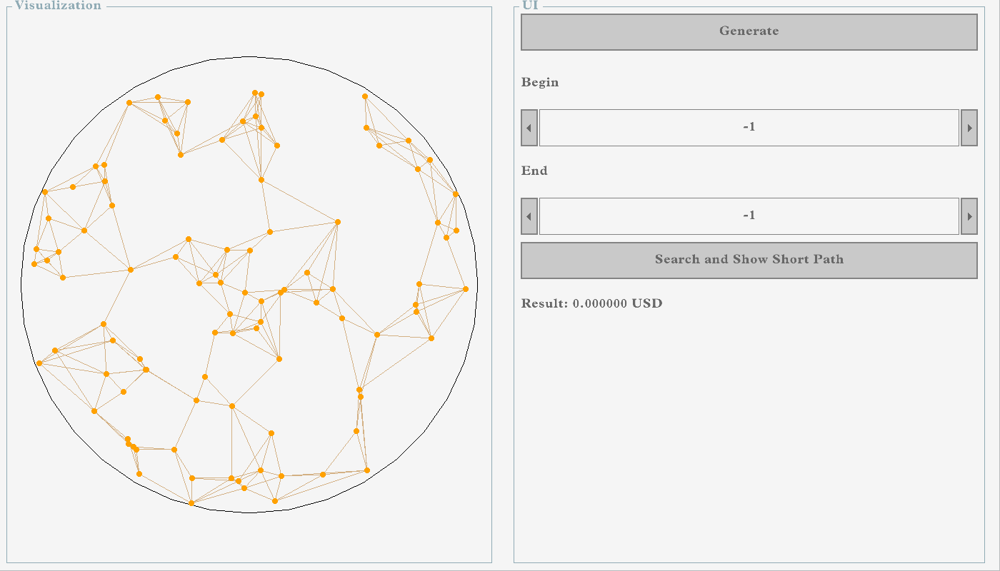
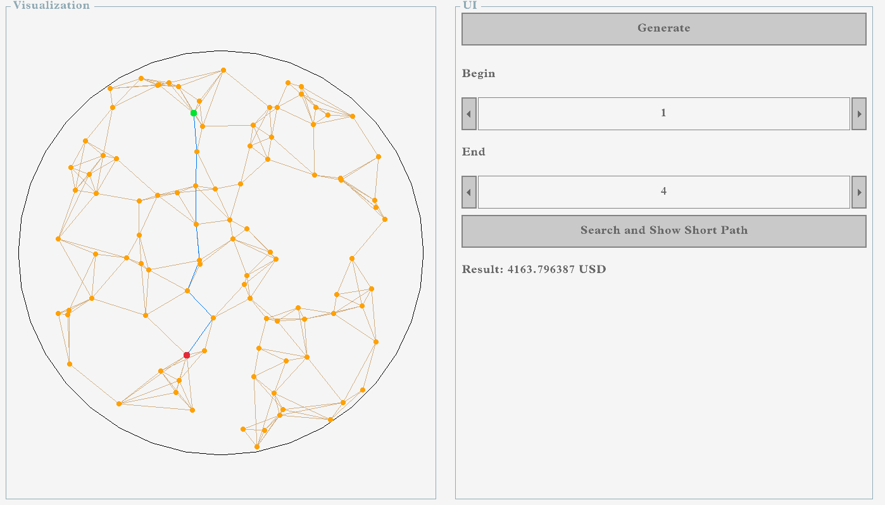
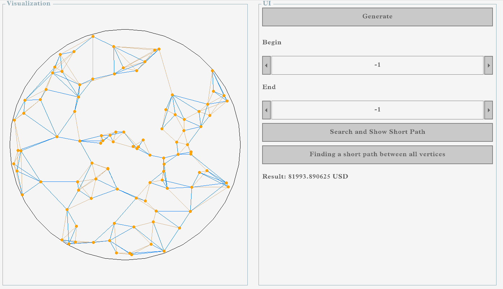

# Техническое задание

### Задание:
 
 Cлучайным образом задаются сто точек точки внутри окружности. Соединить их таким образом, чтобы каждая точка была соединена как минимум с двумя соседними, как максимум - с шестью.
 Теперь представим, что мы путешествуем из первой точки в какую-то (задаётся пользователем). 
 
 Но мы хотим посетить все точки и потратить как можно меньше денег. Скажем, единица расстояния будет стоить
 10 USD. Найти путь, который будет стоить минимум (или близкое к нему количество) денег.

## Инструменты для решения задачи

Данную задачу, нужно было решить на языке С++, а для визуализации решил использовал библиотеки [raylib](https://github.com/raysan5/raylib "библиотека raylib") и [raygui](https://github.com/raysan5/raygui "Библиотека raygui"). Данные библиотеки гарантируют быструю скорость обновления экрана и простоту использования.

## Сборка и запуск

Для сборки и запуска следует клонировать репозиторий и запустить `run` файл, который является исполнительным, этот скрипт соберёт и запустить нужный нам файл.

## Результат работы программы:

Скриншоты:

Окно программы при запуске

Нахождение кратчайшего пути между 2 вершинами

Поиск экономного маршрута между вершина

## Доказательство решения

Для нахождения поиска кратчайшего пути я использовал алгоритм Дейкстры, который находит кратчайшие пути от одной вершины графа до всех остальных вершин. Исходя из этого можно считать ответ что выводит моя программа верный. А так же я находил расстояние между точками используя формулу поиска Евклидового расстояния.

А для соединения всех вершин с минимальным весом (расстоянием в нашем случае) я использовал алгоритм Прима который позволяет создать подграф с единственной элементом связности и инцидентными рёбрами с минимальным весом.

## Обратить внимание
Попрощу заметить что точки заданные в пространстве будут зависеть от разрешения экрана ведь мы полагаемся на расстояние между ними с помощью поиска Евклидового расстояния. По этому результат может быть разным на разных экранах с разрым разрешением